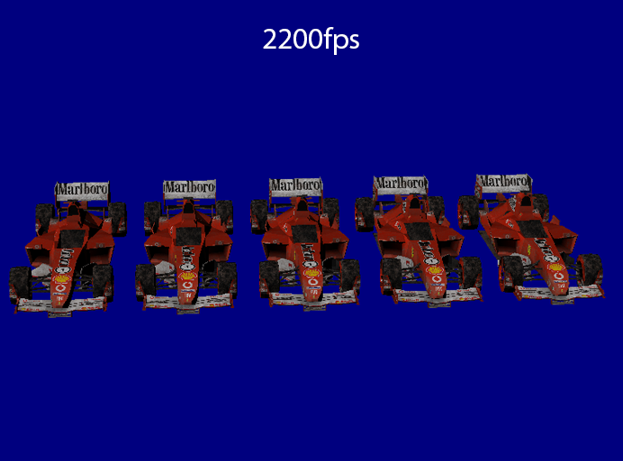
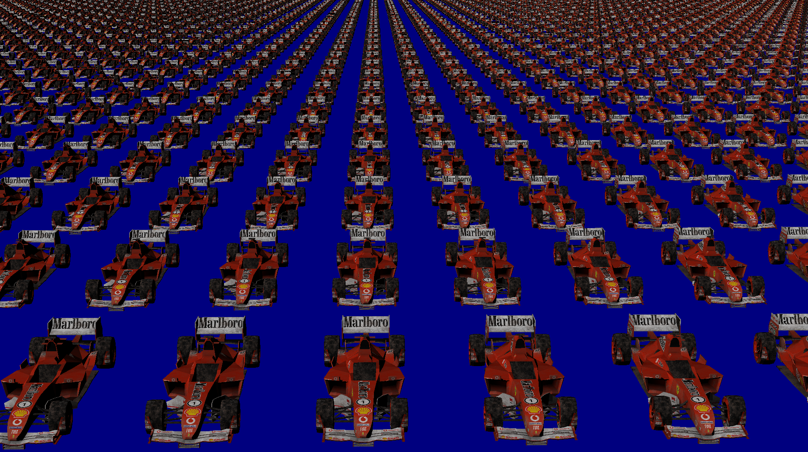

# Instanced Rendering 

Welcome to this Vulkan application showcasing instanced rendering for 2D as well as 3D. Made following the vulkan tutorial, but converted to the C++ implementation.

# Journey
Let me take you on a journey and explain some of the issues I ran into to get to the final result.
## Step 1: Rendering that first triangle!

This first step actually took the longest, although it was probably the simplest one. Vulkan just requires a lot of setup. What I found usefull in this part is that it required me to follow a strict set of rules, there were no visual queues yet if something was applied correctly or incorrectly. Exceptions played an important role here, although they were mostly for null checks they allowed me to find easily where mistakes were made.  
## Step 2: 3D rendering and texturing!

### Data issues
This was supposed to be a simple step. But some silly issues arose that I couldn't have foreseen. The first issue was that I was missing one third of my vertices. It took some time before I realised this made a lot of sense. When I started transforming the pipeline from 2D to 3D, I forgot to change the size value of a vertex. Thus litterly transferring only two thirds of my data to the GPU. Another issue and a way more pressing issue was that it seemed I had an inverted depth buffer. I started looking into the depth pass and everything else related to depth to see if I messed some values up. Little did I know, I was looking in the wrong place. The issue was actually already present since I was rendering 2D, at the time I had no clue, I just thought my values were wrong back then and just changed those. 
This also caused the camera movement to be incorrect.
### Renderdoc to the rescue
After going through my code multiple times, I was suggested to use renderdoc. I then found relatively quickly that the issue was in the viewport, the minDepth and maxDepth were inverted. So I was looking for the correct issue, just not in the right place. For about 2 weeks I was stuck with this inverted depth buffer, once that issue was gone I was able to finish up basic 3D rendering and using single textures for objects. However as you could see in the image above performance really took a hit when I was trying to render the same mesh a couple times. My camera issues were also fixed after inverting the inverted depth buffer.
## Step3: Instanced Rendering!

The final step was the coolest one. In my approach to instanced rendering I push one giant buffer to the vertex shader, and I read from it using the gl_InstanceIndex. This approach does have some drawbacks, since I wanted to render 2D and 3D at the same time.
It meant that I would have to do some bookkeeping on the cpu side of things. After every draw command on the cpu I would have to store the number of instances drawn there, so I could pass it along to the next drawcall as to not start the instancing from zero again.
As an extra challenge I decided to template the pipeline so I could render 2D, 3D and any other vertex type at the same time (maybe 4D in the future). This step proved more work than anticipated as alot of other stuff also had to be templated. 

# Sources
https://www.youtube.com/playlist?list=PLn3eTxaOtL2NH5nbPHMK7gE07SqhcAjmk
