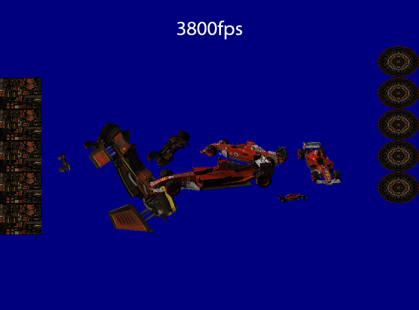
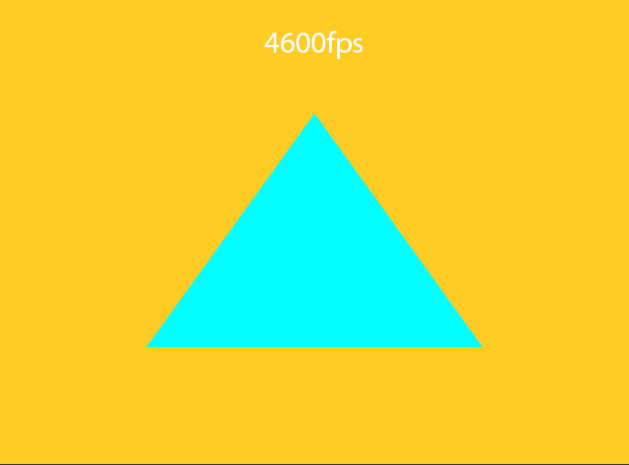

# Instanced Rendering 

Welcome to this Vulkan application showcasing instanced rendering for 2D as well as 3D. Made following the vulkan tutorial, but converted to the C++ implementation.

# Journey

Let me take you on a journey and explain some of the issues I ran into to get to the final result.

## Step 1: Rendering that first triangle!

This first step actually took the longest, although it was probably the simplest one. Vulkan just requires a lot of setup.
What I found usefull in this part is that it required me to follow a strict set of rules, there were no visual queues yet if something was applied correctly or incorrectly.
Exceptions played an important role here, although they were mostly for null checks they allowed me to find easily where mistakes were made.  

## Step 2: 3D rendering and texturing!

